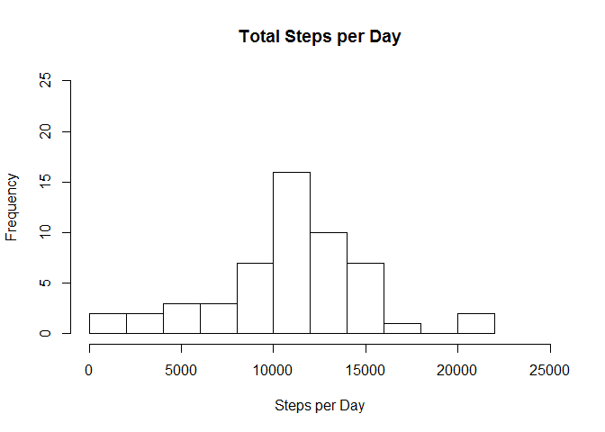
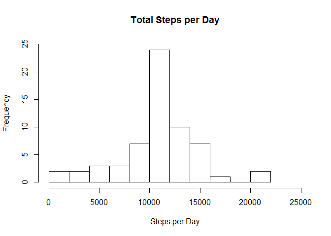
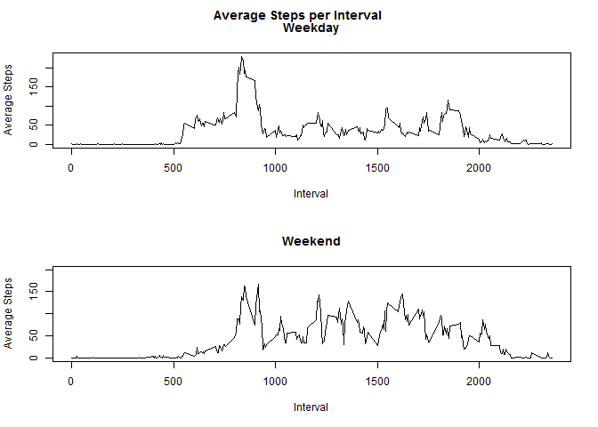

# Reproducible Research: Peer Assessment 1


## Loading and preprocessing the data

```r
rawdata <- read.csv("activity.csv",na.strings = "NA")
```

## What is mean total number of steps taken per day?
For this part of the assignment, we ignore the missing values in the dataset.

1. Calculate the **total** number of steps per day

```r
stepsperday <- aggregate(steps ~ date,rawdata,sum)
```

2. Make a **histogram** of the total number of steps taken each day.

```r
hist(stepsperday$steps, breaks=10, main="Total Steps per Day", xlab="Steps per Day", ylim=c(0,25), xlim=c(0,25000))
```



3. Calculate and report the **mean** and **median** of the total number of steps taken per day.

```r
mean(stepsperday$steps,na.rm=TRUE)
```

```
## [1] 10766.19
```

```r
median(stepsperday$steps,na.rm=TRUE)
```

```
## [1] 10765
```

## What is the average daily activity pattern?
1. Make a **time series** plot of the 5-minute interval and the average number of steps taken, averaged across all days.

```r
stepsperinterval <- aggregate (steps ~ interval,rawdata,mean,na.rm=TRUE)
plot(stepsperinterval$steps ~ stepsperinterval$interval, type="l", main= "Average Steps per Interval", xlab="Interval",ylab="Average Steps")
```


2. Which 5-minute interval, on average across all the days in the dataset, contains the **maxiumum number of steps**?

```r
stepsperinterval[which.max(stepsperinterval$steps),]
```

```
##     interval    steps
## 104      835 206.1698
```

## Imputing missing values
1. Calculate and report the **total number of missing values** in the dataset (i.e. the total number of rows with NAs).

```r
sum(!complete.cases(rawdata))
```

```
## [1] 2304
```

2. Devise a strategy for filling in all of the missing values in the dataset: use interval mean.

3. Create a **new dataset** that is equal to the original dataset but with the missing data filled in by using the overall interval mean.

```r
data2 <-rawdata
data2 <- merge(data2,stepsperinterval,by="interval")
data2$stepsimp <- ifelse(is.na(data2$steps.x),data2$steps.y,data2$steps.x)
data2 <- data2[,c(-2,-4)]
```

4. Make a **histogram** of the total number of steps taken each day and calculate and report the **mean** and **median** total number of steps taken per day.

```r
stepsperday2 <- aggregate(stepsimp ~ date,data2,sum)
hist(stepsperday2$stepsimp, breaks=10, main="Total Steps per Day", xlab="Steps per Day", ylim=c(0,25), xlim=c(0,25000))
```



```r
mean(stepsperday2$stepsimp)
```

```
## [1] 10766.19
```

```r
median(stepsperday2$stepsimp)
```

```
## [1] 10766.19
```


Do these values differ from the estimates from the first part of the assignment?  
- The mean remains the same. The median becomes equal to the mean.

What is the impact of imputing missing data on the estimates of the total daily number of steps?  
- The estimates of the total daily number of steps either remains the same (if the interval imputed from is equal to zero) or is greater than the earlier estimates (if the interval imputed from is greater than zero).

## Are there differences in activity patterns between weekdays and weekends?  
For this part the **weekdays()** function may be of some help. Use the dataset witht he filled-in missing values (data2).

1. Create a new factor variable in the dataset with two levels - "weekday" and "weekend" indicating whether a given date is a weekday or weekend day.First, convert the date variable from a factor to a date class.

```r
data2$date2 <- as.Date(data2$date,format="%Y-%m-%d")
data2$day <- ifelse(weekdays(data2$date2)=="Saturday"|weekdays(data2$date2)=="Sunday",1,2)
data2$day <- as.factor(data2$day)
levels(data2$day) <- c("Weekend","Weekday")
```

2. Make a **panel plot** containing a time series plot of the 5-minute interval and the average number of steps taken, averaged across all weekday days or weekend days.

```r
stepsperinterval2 <- aggregate(stepsimp ~ interval + day,data2,mean)
par(mfrow=c(2,1),cex=.75)
with(subset(stepsperinterval2,day=="Weekday"),plot(stepsimp ~ interval,main="Weekday",type="l",xlab="Interval",ylab="Average Steps"))
with(subset(stepsperinterval2,day=="Weekend"),plot(stepsimp ~ interval,main="Weekend",type="l",xlab="Interval",ylab="Average Steps",ylim=c(0,200)))
title("Average Steps per Interval", outer=TRUE, line=-1.5)
```


